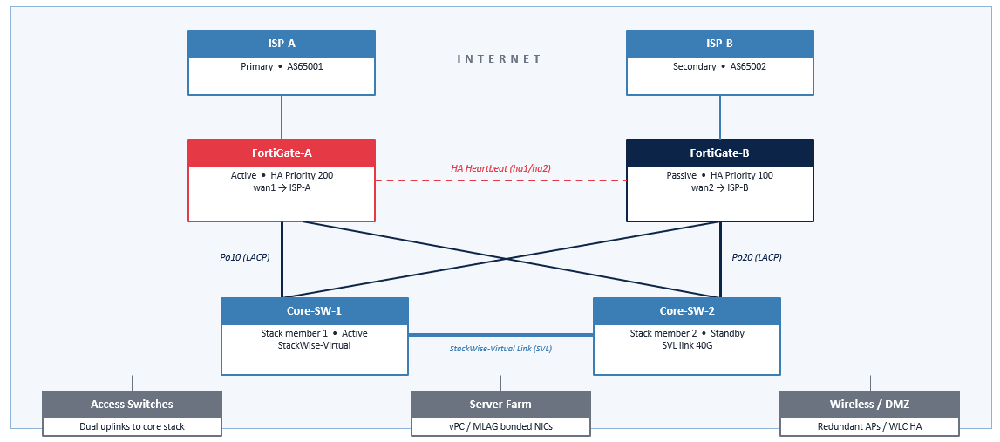

# Full Network Redundancy (FortiGate Firewall  +  Cisco Core Switch)

## Design Overview (HA Cluster · StackWise Core · LACP · HSRP · Dual ISP)

Reference architecture for a fully redundant enterprise edge.
Dual FortiGate firewalls in Active-Passive HA, dual Cisco Catalyst core switches in StackWise (or VSS) with LACP uplinks, HSRP gateway redundancy, and dual ISP failover with SD-WAN.


## Network Topology



## Recommended Redundant Architecture

**Design Principle**
1. Dual FortiGate firewalls — Active-Passive HA with dedicated heartbeat links
2. Dual Cisco Catalyst 9300/9500 core switches — StackWise-Virtual or VSS as a single logical switch
3. LACP (802.3ad) port-channels between FortiGates and the core stack
4. HSRP / VRRP virtual gateway IPs on core SVIs for first-hop redundancy
5. Rapid PVST+ or MST with consistent root bridge priorities
6. Dual ISP with SD-WAN health checks and policy-based failover
7. Out-of-band management network and redundant power (dual PSU + UPS)


## Network Architecture & Addressing

| Segment | Network Address | Default Gateway | Attached Devices / Role |
| :--- | :--- | :--- | :--- |
| **WAN 1** | `203.0.113.2/30` | `203.0.113.1` | ISP-A, WAN1 |
| **WAN 2** | `198.51.100.2/30` | `198.51.100.1` | ISP-B, WAN2 |
| **VLAN 10** | `10.10.10.0/24` | `10.10.10.1` | USER LAN |
| **VLAN 20** | `10.10.20.0/24` | `10.10.20.1` | SERVER LAN |
| **VLAN 30** | `10.10.30.0/24` | `10.10.30.1` | VOICE LAN |
| **VLAN 99** | `10.255.0.0/24` | `10.255.0.10` | MGMT LAN |
| **VLAN 999** |  |  | NATIVE-UNUSED |

## FortiGate HA Cluster Configuration 

| Parameter | FGT-A | FGT-B |
| :--- | :--- | :--- |
| **Hostname** | `FGT-A` | `FGT-B` |
| **Group ID** | `10` | `10` |
| **Group Name** | `CORE-HA` | `CORE-HA` |
| **Mode** | `a-p` (Active-Passive) | `a-p` (Active-Passive) |
| **Password** | `Fortinet!HA2026` | `Fortinet!HA2026` |
| **Heartbeat Devices (hbdev)** | `"ha1" 50`, `"ha2" 100` | `"ha1" 50`, `"ha2" 100` |
| **Session Pickup** | `enable` | `enable` |
| **Session Pickup Connectionless** | `enable` | `enable` |
| **HA Management Status** | `enable` | `enable` |
| **HA Management Interface** | `"mgmt1"` | `"mgmt1"` |
| **HA Management Gateway** | `10.255.0.1` | `10.255.0.1` |
| **Override** | `enable` | `disable` |
| **Priority** | `200` *(Primary candidate)* | `100` *(Secondary candidate)* |
| **Monitor Interfaces** | `"port1"`, `"port2"`, `"wan1"` | `"port1"`, `"port2"`, `"wan1"` |

## FortiGate LACP Aggregate Interface Configuration (`agg1`)

| Command / Parameter | Value | Description |
| :--- | :--- | :--- |
| **Interface Name** | `agg1` | The name of the logical aggregate interface. |
| **vdom** | `root` | Assigns the interface to the "root" Virtual Domain. |
| **type** | `aggregate` | Defines the interface type as an 802.3ad Link Aggregation Group. |
| **member** | `"port1" "port2"` | Physical interfaces bundled into this aggregate group. |
| **lacp-mode** | `active` | Actively transmits LACP packets to negotiate the bond with the peer. |
| **lacp-speed** | `fast` | Requests LACP packets every 1 second (instead of the standard 30 seconds). |
| **min-links** | `1` | Minimum number of operational physical links required to keep the aggregate interface up. |

## FortiGate VLAN Sub-interfaces Configuration on `agg1`

| Interface Name | VDOM | Parent Interface | VLAN ID | IP Address / Subnet | Allowed Administrative Access |
| :--- | :--- | :--- | :--- | :--- | :--- |
| **vl10-users** | `root` | `agg1` | `10` | `10.10.10.2/24` | `ping`, `https`, `ssh` |
| **vl20-servers** | `root` | `agg1` | `20` | `10.10.20.2/24` | `ping` |

## Cisco StackWise Virtual (SVL) Configuration

| Configuration Step | Switch-1 (Primary Candidate) | Switch-2 (Secondary Candidate) |
| :--- | :--- | :--- |
| **Domain ID** | `10` | `10` |
| **SVL Link (SVL1)** | `TenGigabitEthernet1/1/1-2` | `TenGigabitEthernet2/1/1-2` |
| **Dual-Active Detection (DAD)** | `TenGigabitEthernet1/0/48` | `TenGigabitEthernet2/0/48` |
| **Command Mode** | `stackwise-virtual` | `stackwise-virtual` |
| **Final Action** | `write memory` & `reload` | `write memory` & `reload` |

## Cisco Port-Channel Configuration to FortiGate Cluster

| Logical Interface | Physical Members | Description | Mode | Allowed VLANs | Native VLAN | Security/STP |
| :--- | :--- | :--- | :--- | :--- | :--- | :--- |
| **Port-channel10** | `Te1/0/1`, `Te2/0/1` | `>>> FGT-A agg1 <<<` | Trunk | `10, 20, 30, 99` | `999` | `spanning-tree guard root` |
| **Port-channel20** | `Te1/0/2`, `Te2/0/2` | `>>> FGT-B agg1 <<<` | Trunk | `10, 20, 30, 99` | `999` | `spanning-tree guard root` |

### Interface Membership Details

| Physical Interface | Description | Channel Group | LACP Mode |
| :--- | :--- | :--- | :--- |
| **TenGigabitEthernet1/0/1(CORE-SW1)** | FGT-A port1 | `10` | `active` |
| **TenGigabitEthernet2/0/1(CORE-SW2)** | FGT-A port2 | `10` | `active` |
| **TenGigabitEthernet1/0/2(CORE-SW1)** | FGT-B port1 | `20` | `active` |
| **TenGigabitEthernet2/0/2(CORE-SW2)** | FGT-B port2 | `20` | `active` |

## Cisco SVI and HSRPv2 Configuration

| Parameter | VLAN 10 (Users) | VLAN 20 (Servers) |
| :--- | :--- | :--- |
| **Interface Name** | `Vlan10` | `Vlan20` |
| **Description** | `USERS GATEWAY` | `SERVERS GATEWAY` |
| **Physical IP Address** | `10.10.10.252 255.255.255.0` | `10.10.20.252 255.255.255.0` |
| **HSRP Version** | `Version 2` | `Version 2` |
| **HSRP Group ID** | `10` | `20` |
| **Virtual IP (Gateway)** | `10.10.10.1` | `10.10.20.1` |
| **HSRP Base Priority** | `110` | `110` |
| **Preemption** | `Enabled` (with 60s minimum delay) | `Enabled` (immediate) |
| **HSRP Timers** | Hello: `250 msec` / Hold: `750 msec` | *Default (Hello: 3s / Hold: 10s)* |
| **Authentication** | MD5 Key-string: `CORE-HSRP` | *None* |
| **Object Tracking** | Track Object `1` (Decrements priority by `20`) | *None* |

## FortiGate HA — Concepts

### Active-Passive cluster with session synchronization
- Mode: Active-Passive (A-P) — single forwarding unit, hot standby
- Group: same HA group ID, group name and password on both units
- Priority: higher value (e.g. 200) becomes primary; preempt enabled
- Heartbeat: two dedicated interfaces (ha1, ha2) — direct fiber/copper
- Session pickup: stateful failover for TCP/UDP and IPsec tunnels
- Monitor interfaces: WAN + LAN tracked; link loss triggers failover
- Override: set 'override enable' on primary to keep it stable
- Sync: configuration, kernel routes, session table, FIB, IPsec SAs
- Failover target: < 1 second for L2/L3, ~3 s for IPsec re-keying
### Synchronized:
- Configuration (objects, policies)
- Session table (stateful)
- Routing table (FIB / kernel)
- IPsec SAs and FortiGuard cache
- Certificates and local users

## FortiGate CLI — HA Configuration (Apply on BOTH units, sync handles the rest)
### Primary unit (FGT-A)
```bash
# Hostname & HA cluster on FGT-A
config system global
    set hostname FGT-A
end
 
config system ha
    set group-id 10
    set group-name CORE-HA
    set mode a-p
    set password Fortinet     #HA2026
    set hbdev "ha1" 50 "ha2" 100
    set session-pickup enable
    set session-pickup-connectionless enable
    set ha-mgmt-status enable
    config ha-mgmt-interfaces
        edit 1
            set interface "mgmt1"
            set gateway 10.255.0.1
        next
    end
    set override enable
    set priority 200
    set monitor "port1" "port2" "wan1"
end
```
### Secondary unit (FGT-B)
```bash
# Hostname & HA cluster on FGT-B
config system global
    set hostname FGT-B
end
 
config system ha
    set group-id 10
    set group-name CORE-HA
    set mode a-p
    set password Fortinet     #HA2026
    set hbdev "ha1" 50 "ha2" 100
    set session-pickup enable
    set session-pickup-connectionless enable
    set ha-mgmt-status enable
    config ha-mgmt-interfaces
        edit 1
            set interface "mgmt1"
            set gateway 10.255.0.1
        next
    end
    set override disable
    set priority 100
    set monitor "port1" "port2" "wan1"
end
```
### FortiGate — Interfaces, LACP & VLANs (Aggregated uplink to the Cisco core stack)
```bash
# LACP aggregate to core (port1 + port2)
config system interface
    edit "agg1"
        set vdom "root"
        set type aggregate
        set member "port1" "port2"
        set lacp-mode active
        set lacp-speed fast
        set min-links 1
    next
end
 
# Sub-interface VLANs on the aggregate
config system interface
    edit "vl10-users"
        set vdom "root"
        set interface "agg1"
        set vlanid 10
        set ip 10.10.10.2 255.255.255.0
        set allowaccess ping https ssh
    next
    edit "vl20-servers"
        set vdom "root"
        set interface "agg1"
        set vlanid 20
        set ip 10.10.20.2 255.255.255.0
        set allowaccess ping
    next
end
```
```bash
# WAN interfaces for dual ISP
config system interface
    edit "wan1"
        set alias "ISP-A"
        set mode static
        set ip 203.0.113.2 255.255.255.252
        set allowaccess ping
    next
    edit "wan2"
        set alias "ISP-B"
        set mode static
        set ip 198.51.100.2 255.255.255.252
        set allowaccess ping
    next
end
 
# SD-WAN with health checks
config system sdwan
    set status enable
    config members
        edit 1
            set interface "wan1"
            set gateway 203.0.113.1
        next
        edit 2
            set interface "wan2"
            set gateway 198.51.100.1
        next
    end
end
```
### FortiGate — Routing, SD-WAN Rule & Policy (Failover policy and outbound NAT)
```bash
# Static default routes (priority-based failover)
config router static
    edit 1
        set dst 0.0.0.0 0.0.0.0
        set gateway 203.0.113.1
        set device "wan1"
        set priority 10
    next
    edit 2
        set dst 0.0.0.0 0.0.0.0
        set gateway 198.51.100.1
        set device "wan2"
        set priority 20
    next
end
 
# SD-WAN health check via ISP
config system sdwan
    config health-check
        edit "ping-google"
            set server "8.8.8.8" "1.1.1.1"
            set members 1 2
            set failtime 3
            set recoverytime 5
        next
    end
end
```

```bash
# SD-WAN rule: best quality wins
config system sdwan
    config service
        edit 1
            set name "to-internet"
            set mode sla
            set dst "all"
            set src "all"
            config sla
                edit "ping-google"
                    set id 1
                next
            end
            set priority-members 1 2
        next
    end
end
 
# Outbound firewall policy with NAT
config firewall policy
    edit 100
        set name "LAN-to-INET"
        set srcintf "agg1"
        set dstintf "virtual-wan-link"
        set srcaddr "all"
        set dstaddr "all"
        set action accept
        set service "ALL"
        set nat enable
    next
end
```

## Cisco Core — StackWise-Virtual 
### Two physical switches, one logical control plane
- Two Catalyst 9300/9500 switches behave as ONE logical switch
- Active + Standby supervisors with Stateful Switchover (SSO)
- StackWise-Virtual Link (SVL) — 2× 10/40G between members
- Dual-Active Detection (DAD) link prevents split-brain
- Multichassis EtherChannel (MEC) — LACP across both members
- Single config, single management IP, single STP root
- Sub-second convergence on member or link failure
- Upgrade with ISSU (In-Service Software Upgrade)
### Logical View:
- Single Logical Core Switch 
- StackWise-Virtual ID 10
- Mgmt IP 10.255.0.10

## Cisco IOS XE — StackWise-Virtual & VLANs
```bash
# On Switch-1 (will become Active)
!
configure terminal
stackwise-virtual
 domain 10
!
interface range TenGigabitEthernet1/1/1-2
 stackwise-virtual link 1
!
interface TenGigabitEthernet1/0/48
 stackwise-virtual dual-active-detection
!
! On Switch-2
stackwise-virtual
 domain 10
!
interface range TenGigabitEthernet2/1/1-2
 stackwise-virtual link 1
!
interface TenGigabitEthernet2/0/48
 stackwise-virtual dual-active-detection
!
write memory
reload          # reboot both members
!
```

```bash
# VTP & VLAN database (after stack forms)
!
vtp mode transparent
!
vlan 10
 name USERS
vlan 20
 name SERVERS
vlan 30
 name VOICE
vlan 99
 name MGMT
vlan 999
 name NATIVE-UNUSED
!
# Spanning tree — core is root
!
spanning-tree mode rapid-pvst
spanning-tree vlan 1-4094 priority 4096
spanning-tree extend system-id
!
# Mgmt interface (logical)
!
interface Vlan99
 ip address 10.255.0.10 255.255.255.0
 no shutdown
 !
 ```
## Cisco IOS XE — LACP Uplinks to FortiGate
### Multichassis EtherChannel (MEC) across both stack members
```bash
# Port-channel to FortiGate-A (Po10)
!
interface Port-channel10
 description >>> FGT-A agg1 <<<
 switchport
 switchport mode trunk
 switchport trunk native vlan 999
 switchport trunk allowed vlan 10,20,30,99
 spanning-tree guard root
!
interface TenGigabitEthernet1/0/1
 description FGT-A port1
 channel-group 10 mode active
!
interface TenGigabitEthernet2/0/1
 description FGT-A port2
 channel-group 10 mode active
!
```

```bash
# Port-channel to FortiGate-B (Po20)
!
interface Port-channel20
 description >>> FGT-B agg1 <<<
 switchport
 switchport mode trunk
 switchport trunk native vlan 999
 switchport trunk allowed vlan 10,20,30,99
 spanning-tree guard root
!
interface TenGigabitEthernet1/0/2
 description FGT-B port1
 channel-group 20 mode active
!
interface TenGigabitEthernet2/0/2
 description FGT-B port2
 channel-group 20 mode active
!
```

## Cisco IOS XE — HSRP Gateway Redundancy
### Virtual IPs on the core stack point clients at the FortiGate VIP
```bash
# Users SVI with HSRPv2
!
interface Vlan10
 description USERS GATEWAY
 ip address 10.10.10.252 255.255.255.0
 standby version 2
 standby 10 ip 10.10.10.1
 standby 10 priority 110
 standby 10 preempt delay minimum 60
 standby 10 timers msec 250 msec 750
 standby 10 authentication md5 key-string CORE-HSRP
 standby 10 track 1 decrement 20
!
# Servers SVI
!
interface Vlan20
 description SERVERS GATEWAY
 ip address 10.10.20.252 255.255.255.0
 standby version 2
 standby 20 ip 10.10.20.1
 standby 20 priority 110
 standby 20 preempt
!
```
```bash
# Object tracking — uplink to FortiGate HA VIP
!
track 1 ip route 10.10.10.2 255.255.255.255 reachability
!
# Default route to FortiGate cluster VIP
!
ip route 0.0.0.0 0.0.0.0 10.10.10.2 name TO-FGT
!
# Recommended L3 hardening
!
ip cef
no ip source-route
no ip http server
ip http secure-server
service password-encryption
!
# SSH + AAA
!
username netadmin privilege 15 secret S3cret!2026
ip domain name corp.local
crypto key generate rsa modulus 2048
line vty 0 15
 transport input ssh
 login local
 exec-timeout 10 0
!
```

## Verification — Operational Commands (Confirm HA, stack, channels and gateway state)
### FortiGate
```bash
# Cluster health
!
get system ha status
diagnose sys ha status
diagnose sys ha checksum cluster
!
 
# Heartbeat & sync
!
diagnose sys ha dump-by group
diagnose sys session sync
!
 
# Interface & LACP
!
diagnose netlink aggregate name agg1
get system interface physical
!
 
# SD-WAN & routing
diagnose sys sdwan health-check
get router info routing-table all
 
# Force failover for testing
diagnose sys ha reset-uptime
```
### Cisco Core
```bash
# Stack & redundancy
!
show stackwise-virtual
show stackwise-virtual link
show stackwise-virtual dual-active-detection
show redundancy
show switch detail
!
# Port-channels
!
show etherchannel summary
show lacp neighbor
show interfaces Port-channel10 trunk
!
# HSRP & STP
!
show standby brief
show spanning-tree summary
show ip route
!
# CPU / health
!
show platform resources
show logging | include HA|FAIL
!
```


